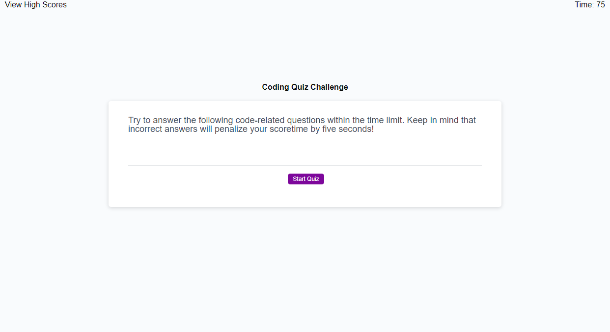
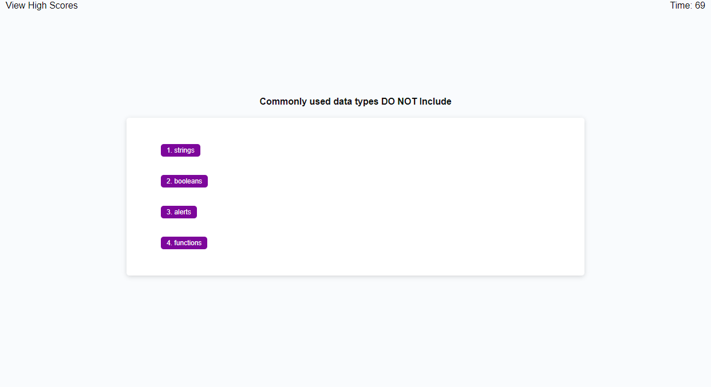
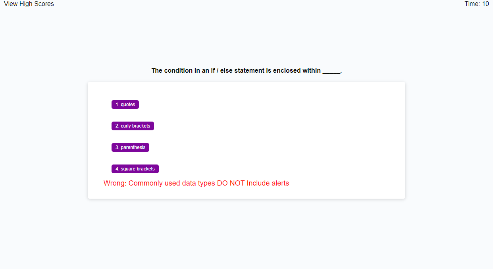
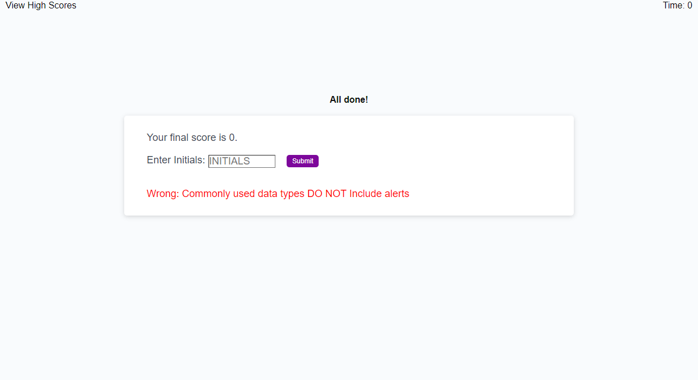
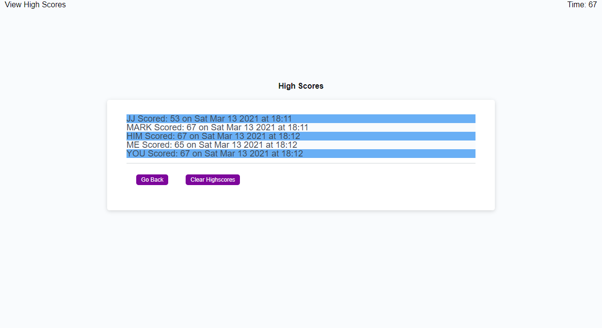

# Web APIs: Code Quiz

## Description

This project was to build a web app that will feature dynamically updated HTML and CSS powered by JavaScript code. The app will provide the user with a timed, multi-question, multiple choice quiz. The app must store high scores so that students can compare their scores.

```md
The app should operate within the following requirements:
1. The quiz begins and a timer starts when the user clicks on the Start button.
2. The user should be presented with a question and multiple choice answers.
3. The user will be presented with the next question after selecting an answer.
    * This will repeat until are questions are processed or the timer expires.
4. The timer is reduced for each wrong answer.
5. When all questions are answered or the timer expires the user is prompted to save their score.
6. The user can view all high scores by selecting a link on any page or after submitting their score.
7. If the user selects to view high scores from a question page they will be shown the high scores, the timer will not stop, and the user will then be returned to the question where they left.
```
## Table of Contents

* [Installation](#installation)
* [Usage](#usage)
* [Credits](#credits)
* [License](#license)
* [Badges](#badges)
* [Features](#features)
* [Contributing](#contributing)
* [Tests](#tests)


## Installation

```md
The following steps should be used to install:
1. Push code to GitHub repository
    * git add -A
    * git committ -m "descriptive message"
    * git push
2. Select the Settings in GitHub
    * Scroll down to the GitHub Pages section
    * Under Source select to use main branch as source
```

## Usage 

Navigate to:
[https://markhatthorinc.github.io/03-JavaScript/](https://markhatthorinc.github.io/04-Web-APIs/)

**Images of App:**







## Credits

Trilogy Education Services, LLC, a 2U, Inc. brand


## License

MIT License

Copyright (c) 2021 Mark S. Harrison

Permission is hereby granted, free of charge, to any person obtaining a copy
of this software and associated documentation files (the "Software"), to deal
in the Software without restriction, including without limitation the rights
to use, copy, modify, merge, publish, distribute, sublicense, and/or sell
copies of the Software, and to permit persons to whom the Software is
furnished to do so, subject to the following conditions:

The above copyright notice and this permission notice shall be included in all
copies or substantial portions of the Software.

THE SOFTWARE IS PROVIDED "AS IS", WITHOUT WARRANTY OF ANY KIND, EXPRESS OR
IMPLIED, INCLUDING BUT NOT LIMITED TO THE WARRANTIES OF MERCHANTABILITY,
FITNESS FOR A PARTICULAR PURPOSE AND NONINFRINGEMENT. IN NO EVENT SHALL THE
AUTHORS OR COPYRIGHT HOLDERS BE LIABLE FOR ANY CLAIM, DAMAGES OR OTHER
LIABILITY, WHETHER IN AN ACTION OF CONTRACT, TORT OR OTHERWISE, ARISING FROM,
OUT OF OR IN CONNECTION WITH THE SOFTWARE OR THE USE OR OTHER DEALINGS IN THE
SOFTWARE.

## Badges


## Features

There are no special features on this page.

## Contributing


## Tests

```md
Verify links work:
1. Click on _Start Quiz Button_
2. You should be presented questions with multiple choice answers
    * Click on the answer you think is correct
3. Timer in right-hand corner of screen should be decrementing
    * Wrong answers should have additional time deducted from the timer
4. After all questions are answered you should be prompted to save your score
5. After saving your score you should be shown all high scores.
    * You can reset high scores by clicking on _Clear Highscores Button_
    * You will be returned to the start page by clicking on _Go Back Button_
6. At any time during the quiz you can view all high scores
    * If timer was running it should continue to run
    * Clicking on _Go Back Button_ should return you to the screen where you selected to view high scores
```

```md
Verify page layout and that all images display.
```
